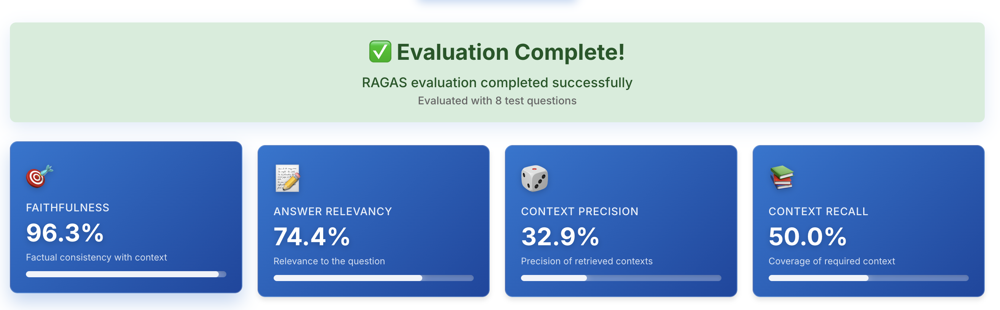
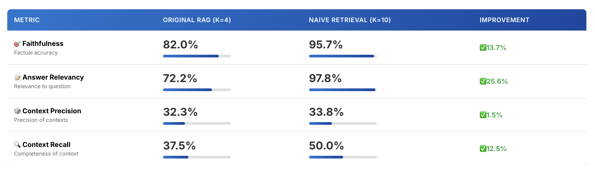

We both are planning to work on an assignment

The plan is as follows

1. Write 1-2 paragraphs on why this is a problem for your specific user:

    The problem we are trying to solve is a problem faced by parents.
    Parents gets a lot of email from schools about different events and programs.
    Its hard to remember all these.

2. Propose a Solution

    I am creating a tool where the user can ask AI to find events and programs based on user's choice by looking at all the data from schools.

3. Describe the tools you plan to use in each part of your stack.  Write one sentence on why you made each tooling choice.

    - Qdrant is used as the local vector store for school events data, chosen for its speed and scalability with embeddings.
    - Tavily is used to search the events and programs from schools online, providing up-to-date information.
    - LangChain and LangGraph are used for agent orchestration and RAG pipeline, enabling flexible multi-agent workflows.

4. Where will you use an agent or agents?  What will you use “agentic reasoning” for in your app?

The multi-agent system uses two agents:
    - LocalEvents agent (searches Qdrant vector store for local school events data)
    - WebSearch agent (uses Tavily for online search)
Agents are orchestrated using LangGraph, with fallback logic: LocalEvents is tried first, then WebSearch if no useful results are found. This enables autonomous reasoning about which data source to use and synthesizes information from both sources for comprehensive answers.

5. Describe all of your data sources and external APIs, and describe what you’ll use them for.

    - All school events data is saved as TXT files in the data folder and indexed in Qdrant.
    - Tavily tool is used to search for current events and programs online.

6. Describe the default chunking strategy that you will use.  Why did you make this decision?

    I use RecursiveCharacterTextSplitter with the following configuration:

    - **Chunk size**: 1000 characters
    - **Chunk overlap**: 200 characters
    - **Splitter type**: RecursiveCharacterTextSplitter
    - **Separators**: ["\n\n", "\n", ",", " ", ""]

    **Why We Made This Decision:**
    

     1. **Improved Retrieval Accuracy**:
         - Without chunking, each TXT file was stored as a single large document (65 documents total)
         - This caused poor semantic matching for specific queries
         - For example, "Karate Classes for Youth by Dragon Martial Arts Studio" couldn't be found in the top-10 results
         - After implementing chunking, the 65 TXT documents were split into 145 smaller chunks, significantly improving retrieval

     2. **Balanced Chunk Size**:
         - 1000 characters provides enough context for the embedding model to understand each piece while staying well within token limits
         - Not too large (keeps embeddings focused on specific content) and not too small (preserves contextual relationships)

     3. **Smart Overlap Strategy**:
         - 200-character overlap ensures that related information spanning chunk boundaries isn't lost
         - Helps maintain coherence across chunk boundaries, especially for multi-topic event descriptions

     4. **Text-Aware Separators**:
         - Custom separator sequence ["\n\n", "\n", ",", " ", ""] respects natural text boundaries
         - Prioritizes splitting at double newlines, single newlines, commas, and spaces before breaking mid-word
         - This preserves the integrity of event descriptions and context

     **Results**: The chunking strategy improved retrieval from 65 large TXT documents to 145 focused chunks, enabling successful retrieval of specific event information that was previously unreachable.

7. Assess your pipeline using the RAGAS framework including key metrics faithfulness, response relevance, context precision, and context recall. Provide a table of your output results.

    

8. What conclusions can you draw about the performance and effectiveness of your pipeline with this information?

    

9. Swap out base retriever with advanced retrieval methods.

    - The code now defaults to the Naive retrieval method and multi-agent system for queries.

10. How does the performance compare to your original RAG application? Test the new retrieval pipeline using the RAGAS frameworks to quantify any improvements. Provide results in a table.

       